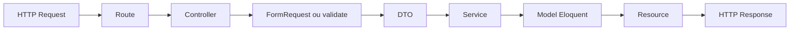
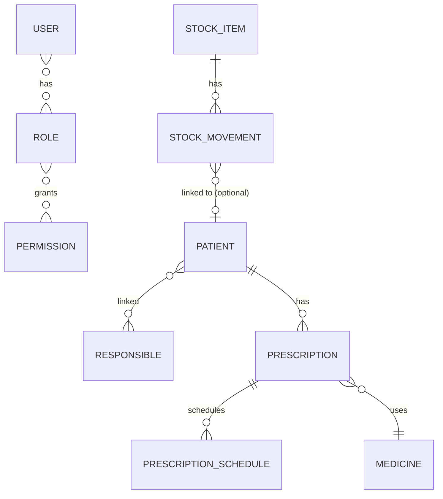
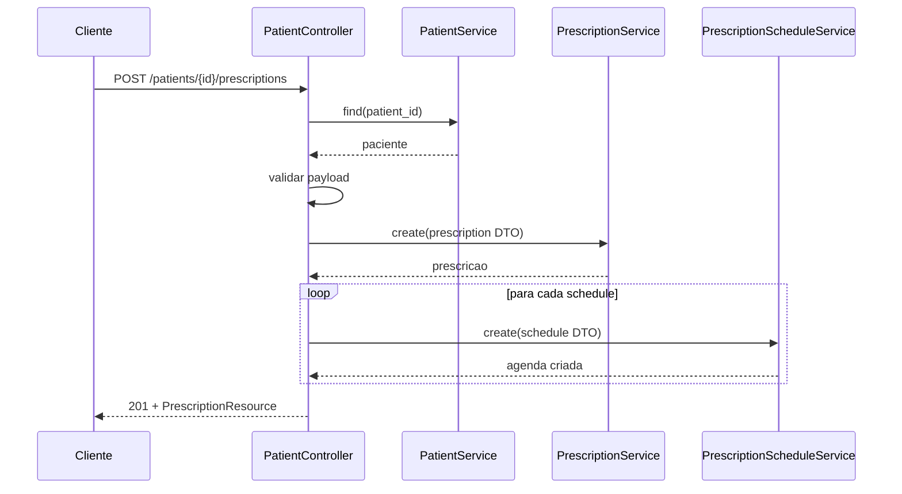

# Especificações do Projeto — Extension API

Documento consolidado com todas as especificações técnicas e de negócio do projeto. Baseado no código-fonte atual e na documentação em `docs/`.

> **Pendente de regeneração:** `docs/01`, `docs/03`, `docs/04` e `docs/06` já foram atualizados com a nova entidade `PatientMedicine`/`PatientMedicineMovement` (estoque de medicamento por paciente). Este consolidado ainda não reflete essa mudança — regenerar a partir de `docs/` antes de tratá-lo como fonte de verdade.

---

## 1. Visão Geral

API em Laravel para gestão de **pacientes**, **responsáveis**, **prescrições** e **horários de medicação**, com autenticação via **Sanctum** e painel administrativo via **Filament**.

### Stack Principal
| Camada | Tecnologia |
|---|---|
| Backend | Laravel 12 (PHP ^8.2) |
| Autenticação API | Laravel Sanctum ^4.0 |
| Painel administrativo | Filament ^5.0 |
| Documentação da API | L5-Swagger / OpenAPI ^8.5.1 |
| Persistência | Eloquent ORM, chaves primárias ULID, Soft Deletes |
| DTOs | pacote `alvarez/concrete-dto` ^1.0 |
| Frontend/build | Vite 7, TailwindCSS 4, Axios |
| Testes | Pest 4 |
| Localização | pt_BR (lucascudo/laravel-pt-br-localization) |

### Entidades Centrais
- **User** — usuário autenticado; pode ser administrador (`is_adm`) e possuir vários papéis (roles).
- **Role** — papel funcional (ex.: enfermagem, farmácia), ligado a usuários e permissões.
- **Permission** — ação por tela (`screen` + `name`), usada pelas policies.
- **Patient** — paciente com dados pessoais, prescrições e responsáveis vinculados.
- **Responsible** — responsável legal/familiar vinculado a pacientes.
- **Prescription** — prescrição de um medicamento para um paciente, com período de vigência.
- **PrescriptionSchedule** — agenda da prescrição (dia da semana, horário, quantidade).
- **Medicine** — medicamento usado na prescrição.
- **StockItem** — item de estoque (enxoval do residente ou insumo médico), com saldo atual e estoque mínimo. Operado pelo painel Filament (`StockItemResource`, grupo "Estoque") além da API.
- **StockMovement** — log de entrada/saída/ajuste/devolução de um `StockItem`, opcionalmente vinculado a um paciente.
- **StockDonation** — registro público (sem autenticação) de alguém trazendo um item para um paciente específico (identificado por CPF); fica `PENDING` até um admin confirmar ou cancelar pelo painel Filament.

### Convenções de Fluxo
- **Entrada**: Controller + FormRequest (validação inline em poucos casos, ex. `storePrescription`).
- **Transporte de dados**: DTOs (`app/DTO/*`).
- **Persistência**: Services com métodos `create`, `find`, `update`, `delete`.
- **Saída**: API Resources (`app/Http/Resources/*`).
- **Operações críticas**: `DB::transaction(...)` quando há escrita composta.

### Comportamento de Erro de Autenticação
- Requisições em `api/*` sem autenticação recebem `401` JSON (`"Unauthenticated."`).
- Requisições web não autenticadas redirecionam para o login do Filament.
- Configurado em `bootstrap/app.php`.

---

## 2. Arquitetura

### Camadas
- **Routes** (`routes/api.php`) — endpoints, middleware `auth:sanctum`, rotas de relacionamento.
- **Controllers** (`app/Http/Controllers`) — orquestram validação, DTO, transação e resposta HTTP.
- **FormRequests** (`app/Http/Requests`) — centralizam validações de entrada.
- **DTOs** (`app/DTO`) — formalizam payload entre controller e service.
- **Services** (`app/Services`) — encapsulam operações sobre modelos Eloquent (thin services / CRUD).
- **Models** (`app/Models`) — relacionamentos, casts e ciclo de vida (soft delete/restore em cascata).
- **Policies** (`app/Policies`) — autorização baseada em permissão por tela.
- **Resources** (`app/Http/Resources`) — serialização da resposta da API.

### Fluxo Técnico Padrão



### Relacionamentos de Domínio



### Decisões Arquiteturais Observadas
- Uso consistente de Soft Deletes para entidades de negócio.
- Regras de cascata implementadas nos **models** (não apenas no banco).
- Autorização por tela/ação via combinação Role → Permission e Policies.
- API e painel Filament convivem no mesmo projeto, com tratamento de autenticação distinto por contexto.

### Pontos de Atenção
- Nem todos os endpoints usam FormRequest (ex.: `PatientController::storePrescription`).
- Services atuais são *thin services* (CRUD simples); regras de negócio mais complexas tendem a ficar em controllers/model events.

---

## 3. Modelo de Dados (Schema do Banco)

Todas as tabelas de domínio usam **ULID** como chave primária e possuem `timestamps()` + `softDeletes()`, exceto as tabelas pivô.

### `users`
| Campo | Tipo | Observações |
|---|---|---|
| id | ulid, PK | |
| name | string | |
| document_type | string | enum `DocumentTypeEnum` |
| document_number | string | único em conjunto com `document_type` |
| password | string | |
| is_adm | boolean | default `false`; concede acesso total nas policies |
| remember_token | string | |
| timestamps / soft delete | | |

### `patients`
| Campo | Tipo | Observações |
|---|---|---|
| id | ulid, PK | |
| name | string | |
| document_type | string | enum `DocumentTypeEnum` |
| document_number | string | |
| admission_date | date | |
| birthday | date | |
| phone | string, nullable | |
| nursing_report | json, nullable | |
| timestamps / soft delete | | |

### `responsibles`
| Campo | Tipo | Observações |
|---|---|---|
| id | ulid, PK | |
| name | string | |
| document_type | string | |
| document_number | string | único em conjunto com `document_type` |
| phone | string, nullable | |
| timestamps / soft delete | | |

### `patient_responsible` (pivô N:N)
| Campo | Tipo |
|---|---|
| patient_id | FK → patients, cascade on delete |
| responsible_id | FK → responsibles, cascade on delete |
| PK composta | (patient_id, responsible_id) |

### `medicines`
| Campo | Tipo | Observações |
|---|---|---|
| id | ulid, PK | |
| name | string | |
| content_quantity | integer | |
| content_unit | string | enum `ContentUnitEnum` |
| strength | string | |
| is_compounded | boolean | default `false` (manipulado ou não) |
| route_of_administration | string | enum `RouteOfAdministrationEnum` |
| additional_information | text, nullable | |
| timestamps / soft delete | | |

### `prescriptions`
| Campo | Tipo | Observações |
|---|---|---|
| id | ulid, PK | |
| patient_id | FK → patients, cascade on delete | |
| medicine_id | FK → medicines, cascade on delete | |
| start_date | date | |
| end_date | date, nullable | |
| instructions | text, nullable | |
| timestamps / soft delete | | |

### `prescription_schedules`
| Campo | Tipo | Observações |
|---|---|---|
| id | ulid, PK | |
| prescription_id | FK → prescriptions, cascade on delete | |
| day_of_week | tinyInteger | enum `DayOfWeekEnum` (0=domingo … 6=sábado) |
| time | time | formato `H:i` |
| quantity | integer | >= 1 |
| timestamps / soft delete | | |

### `medication_administrations`
Registra a aplicação de uma dose numa data específica (o `prescription_schedule` é o template semanal recorrente; cada linha aqui é uma ocorrência de um dia concreto). Sem soft delete — é um log operacional, não uma entidade de negócio.

| Campo | Tipo | Observações |
|---|---|---|
| id | ulid, PK | |
| prescription_schedule_id | FK → prescription_schedules, cascade on delete | |
| scheduled_date | date | data da ocorrência |
| applied_at | timestamp, nullable | preenchido quando a dose é marcada como aplicada |
| applied_by_user_id | FK → users, nullable, null on delete | quem aplicou |
| timestamps | | |
| único | (prescription_schedule_id, scheduled_date) | evita duplicar a mesma ocorrência |

### `stock_items`
| Campo | Tipo | Observações |
|---|---|---|
| id | ulid, PK | |
| name | string | |
| category | string | enum `StockItemCategoryEnum` |
| unit | string | enum `StockItemUnitEnum` |
| current_quantity | integer | saldo atual; só muda via `stock_movements`, não editável em `PUT`/`PATCH` |
| minimum_quantity | integer, nullable | usado para sinalizar estoque baixo |
| requires_batch_control | boolean | default `false` |
| additional_information | text, nullable | |
| timestamps / soft delete | | |

### `stock_movements`
Log operacional de entrada/saída/ajuste/devolução. Sem soft delete, mesmo padrão de `medication_administrations`.

| Campo | Tipo | Observações |
|---|---|---|
| id | ulid, PK | |
| stock_item_id | FK → stock_items, cascade on delete | |
| type | string | enum `StockMovementTypeEnum` |
| quantity | integer | >= 0; efeito no saldo depende de `type` |
| patient_id | FK → patients, nullable, null on delete | obrigatório em `OUT`/`RETURNED` quando o item é `RESIDENT_SUPPLY` |
| user_id | FK → users, nullable, null on delete | quem registrou (do usuário autenticado) |
| batch | string, nullable | obrigatório em `IN` quando `requires_batch_control = true` |
| expiry_date | date, nullable | idem `batch` |
| notes | text, nullable | |
| movement_date | datetime | |
| stock_donation_id | FK → stock_donations, nullable, null on delete | preenchido quando a movimentação veio de uma doação confirmada |
| timestamps | | sem soft delete |

### `stock_donations`
Registro público (sem autenticação) de item trazido para um paciente específico.

| Campo | Tipo | Observações |
|---|---|---|
| id | ulid, PK | |
| stock_item_id | FK → stock_items, cascade on delete | |
| patient_id | FK → patients, cascade on delete | resolvido a partir do CPF informado no formulário público |
| quantity | integer | |
| donor_name | string | |
| donor_phone | string, nullable | |
| notes | text, nullable | |
| status | string | enum `StockDonationStatusEnum` (`PENDING`, `CONFIRMED`, `CANCELLED`) |
| reviewed_by_user_id | FK → users, nullable, null on delete | |
| reviewed_at | timestamp, nullable | |
| timestamps / soft delete | | |

### `roles`
| Campo | Tipo |
|---|---|
| id | ulid, PK |
| name | string, único |
| timestamps / soft delete | |

### `permissions`
| Campo | Tipo | Observações |
|---|---|---|
| id | ulid, PK | |
| name | string | ação (ex.: `listar`, `criar`, `atualizar`, `deletar`) |
| screen | string | enum `PermissionScreenEnum` |
| timestamps / soft delete | | |

### `role_user` e `permission_role` (pivôs N:N)
Chave incremental própria (`id`) + FKs com cascade on delete + timestamps (sem soft delete).

### `personal_access_tokens`
Tabela padrão do Sanctum (morphs ULID) para tokens de API.

---

## 4. Enums de Domínio

| Enum | Valores |
|---|---|
| `DocumentTypeEnum` | `CPF`, `CNPJ` |
| `ContentUnitEnum` | `MG`, `MCG`, `G`, `ML`, `IU`, `UNIT` (implementa `HasLabel` do Filament) |
| `RouteOfAdministrationEnum` | `ORAL`, `SUBLINGUAL`, `TOPICAL`, `INHALATION`, `INTRAVENOUS`, `INTRAMUSCULAR`, `SUBCUTANEOUS` |
| `DayOfWeekEnum` | `Sunday=0` … `Saturday=6` |
| `PermissionScreenEnum` | `medicines_screen`, `users_screen`, `patients_screen`, `roles_screen`, `responsibles_screen`, `prescriptions_screen`, `stock_screen`, `give_permissions_to_roles_screen` |
| `StockItemCategoryEnum` | `RESIDENT_SUPPLY`, `MEDICAL_SUPPLY` |
| `StockItemUnitEnum` | `UNIT`, `PAIR`, `BOX`, `PACK`, `ML`, `G` |
| `StockMovementTypeEnum` | `IN`, `OUT`, `ADJUSTMENT`, `RETURNED` |
| `StockDonationStatusEnum` | `PENDING`, `CONFIRMED`, `CANCELLED` |

---

## 5. API — Endpoints

### Autenticação
| Método | Rota | Auth | Descrição |
|---|---|---|---|
| POST | `/api/auth/register` | não | Registro de usuário |
| POST | `/api/auth/login` | não | Login, retorna token Sanctum |
| POST | `/api/auth/logout` | sim | Revoga token atual |
| GET | `/api/user` | sim | Retorna o usuário autenticado |

Header de autenticação: `Authorization: Bearer <token>`.

**Login e cadastro de usuário são restritos a CPF.** O payload de `login`/`register` não recebe mais `document_type` — o backend sempre identifica o `User` por `document_type = CPF`. `Patient` e `Responsible` continuam aceitando CPF ou CNPJ normalmente; a restrição vale só para quem se autentica no sistema (`User`).

### Recursos CRUD padrão
Todos protegidos por `auth:sanctum`. Cada recurso abaixo segue o padrão `apiResource` (index/store/show/update/destroy) **mais** rotas extras de soft delete:
- `GET /{recurso}/trashed`
- `POST /{recurso}/{id}/restore`
- `DELETE /{recurso}/{id}/force-delete`

Recursos: `users`, `patients`, `responsibles`, `medicines`, `roles`, `prescriptions`, `prescription-schedules`, `stock-items`.

### Movimentações e Consultas de Estoque
| Método | Rota | Descrição |
|---|---|---|
| GET | `/api/stock-items/low-stock` | Itens com `current_quantity <= minimum_quantity` |
| GET | `/api/stock-items/{stockItem}/movements` | Histórico de movimentações do item |
| POST | `/api/stock-items/{stockItem}/movements` | Registra movimentação (`IN`/`OUT`/`ADJUSTMENT`/`RETURNED`) |
| GET | `/api/patients/{patient}/stock-items` | Itens de enxoval atualmente em uso pelo paciente (calculado a partir de `stock_movements`) |

### Permissions (somente leitura/gestão pontual, sem `store`/`update` genéricos)
| Método | Rota | Descrição |
|---|---|---|
| GET | `/api/permissions` | Lista permissões |
| GET | `/api/permissions/trashed` | Lista permissões removidas |
| GET | `/api/permissions/screens` | Lista telas disponíveis (`PermissionScreenEnum`) |
| GET | `/api/permissions/grouped` | Permissões agrupadas por tela |
| GET | `/api/permissions/{permission}` | Detalhe |
| DELETE | `/api/permissions/{permission}` | Soft delete |
| POST | `/api/permissions/{permission}/restore` | Restaura |
| DELETE | `/api/permissions/{permission}/force-delete` | Exclusão física |

### Relacionamento Paciente ↔ Responsável
| Método | Rota |
|---|---|
| POST | `/api/patients/{patient}/responsibles/{responsible}` |
| DELETE | `/api/patients/{patient}/responsibles/{responsible}` |
| GET | `/api/patients/{patient}/responsibles` |
| POST | `/api/responsibles/{responsible}/patients/{patient}` |
| DELETE | `/api/responsibles/{responsible}/patients/{patient}` |
| GET | `/api/responsibles/{responsible}/patients` |

### Prescrições por Paciente / Agendas por Prescrição
| Método | Rota |
|---|---|
| GET | `/api/patients/{patient}/prescriptions` |
| POST | `/api/patients/{patient}/prescriptions` |
| GET | `/api/prescriptions/{prescription}/schedules` |

### Usuário ↔ Papel
| Método | Rota |
|---|---|
| GET | `/api/users/{user}/roles` |
| POST | `/api/users/{user}/roles/{role}` |
| DELETE | `/api/users/{user}/roles/{role}` |
| GET | `/api/roles/{role}/users` |
| POST | `/api/roles/{role}/users/{user}` |
| DELETE | `/api/roles/{role}/users/{user}` |

### Papel ↔ Permissão por Tela
| Método | Rota | Descrição |
|---|---|---|
| GET | `/api/roles/{role}/permissions?screen=...` | Lista permissões disponíveis/selecionadas de uma tela |
| PUT | `/api/roles/{role}/permissions` | Sincroniza permissões da tela alvo (preserva outras telas) |
| POST | `/api/roles/{role}/permissions/activate-all` | Ativa todas as permissões da tela |
| POST | `/api/roles/{role}/permissions/disable-all` | Desativa todas as permissões da tela |

### Paginação
Listagens usam paginação padrão de tamanho 10 (`paginate(10)`).

### Erros Comuns
| Código | Significado |
|---|---|
| 401 | Não autenticado em rota protegida |
| 404 | Registro não encontrado (`findOrFail`) |
| 422 | Falha de validação |

### Rotas Web Públicas (fora de `/api` e de `auth:sanctum`)
| Método | Rota | Descrição |
|---|---|---|
| GET | `/doacoes` | Formulário público para registrar um item trazido para um paciente (por CPF) |
| POST | `/doacoes` | Registra a doação como `PENDING`; rejeita CPF que não corresponda a paciente cadastrado |

Definidas em `routes/web.php`, servidas por `StockDonationPublicController` — não usam Sanctum nem retornam JSON, é uma view Blade tradicional. A validação/confirmação (`Confirmar`/`Cancelar`) é feita pelo `StockDonationResource` no painel Filament (autenticado), não por essas rotas.

### Documentação OpenAPI
- Anotações centrais: `app/OpenApi/ApiDocumentation.php`
- UI Swagger: `/api/documentation`

---

## 6. Fluxos de Negócio

### 6.1 Cadastro de Paciente
**Endpoint:** `POST /api/patients`

- **FormRequest:** `CreatePatientFormRequest`
- **Campos:** `name`, `document_type`, `document_number`, `admission_date`, `birthday`, `phone?`, `nursing_report?`
- **Regras:**
  - `document_type` deve ser um valor válido do enum.
  - `document_number` deve ser único por `document_type`.
  - Datas devem ser válidas.
- **Sequência:** Controller valida via FormRequest → monta `CreatePatientDTO` (converte `document_type` para enum e datas para `Carbon`) → `PatientService::create(...)` em transação → retorna `PatientResource` com `201`.
- **Erros:** `422` validação, `401` sem token.

### 6.2 Criar Prescrição para Paciente (com agendas)
**Endpoint:** `POST /api/patients/{patient}/prescriptions`

- **Validação:** inline no controller (não usa FormRequest).
- **Campos:** `medicine_id`, `start_date`, `end_date`, `instructions?`, `prescription_schedules?[]` (cada item: `day_of_week` 0–6, `time` `H:i`, `quantity` >= 1).
- **Regras:** paciente e medicamento devem existir; `end_date >= start_date`; agendas devem respeitar regras de dia/horário/quantidade.
- **Sequência:**
  1. Garante existência do paciente via `PatientService::find(...)`.
  2. Valida request.
  3. Em transação: cria `CreatePrescriptionDTO` e salva via `PrescriptionService::create`; itera agendas recebidas criando cada uma via `PrescriptionScheduleService::create`.
  4. Retorna `PrescriptionResource` com `201`.
- **Erros:** `404` paciente inexistente, `422` validação, `401` sem token.



### 6.3 Soft Delete e Restore em Cascata
**Entidades principais:** `Patient` e `Prescription`.

- Ao deletar (soft delete) um **paciente**, suas prescrições também são soft deleted.
- Ao restaurar um paciente, as prescrições soft deleted são restauradas.
- Ao *force delete* de um paciente, as prescrições (inclusive as já trashed) são force deleted.
- A mesma lógica se aplica de **prescrição** para **agendas** (`PrescriptionSchedule`).
- Implementado nos hooks `Patient::booted()` e `Prescription::booted()`.

### 6.4 Gerir Permissões de um Papel por Tela
**Endpoints:**
- `GET /api/roles/{role}/permissions?screen=...`
- `PUT /api/roles/{role}/permissions`
- `POST /api/roles/{role}/permissions/activate-all`
- `POST /api/roles/{role}/permissions/disable-all`

- **Regras:** `screen` deve existir em `PermissionScreenEnum`; o `sync` deve preservar permissões de outras telas.
- **Sequência (sync):**
  1. Valida `screen` e lista de `permissions` (nomes).
  2. Busca IDs das permissões selecionadas na tela alvo.
  3. Busca IDs das permissões já vinculadas em outras telas.
  4. Faz `sync` da união (outras telas + tela atual selecionada).
- **Resultado:** atualização atômica das permissões da tela alvo, sem apagar o contexto das demais telas.

### 6.5 Registrar Movimentação de Estoque
**Endpoint:** `POST /api/stock-items/{stockItem}/movements`

- **FormRequest:** `CreateStockMovementFormRequest`.
- **Campos:** `type` (`IN`/`OUT`/`ADJUSTMENT`/`RETURNED`), `quantity`, `patient_id?`, `batch?`, `expiry_date?`, `notes?`, `movement_date?`. `stock_item_id` vem da rota; `user_id` vem do usuário autenticado.
- **Regras:** `IN`/`OUT`/`RETURNED` aplicam delta sobre `current_quantity`; `ADJUSTMENT` define o saldo diretamente (correção de contagem física). Saldo nunca pode ficar negativo. `patient_id` obrigatório em `OUT`/`RETURNED` para itens `RESIDENT_SUPPLY`. `batch`/`expiry_date` obrigatórios em `IN` quando `requires_batch_control = true`.
- **Sequência:** Controller valida via FormRequest → monta `CreateStockMovementDTO` → em transação, `StockMovementService::create` busca o item, valida as regras e aplica o efeito sobre o saldo via `StockItemService` → cria o registro em `stock_movements` → retorna `StockMovementResource` com `201`.
- **Erros:** `404` item inexistente, `422` validação/saldo insuficiente/paciente ou lote ausentes, `401` sem token.
- **Consultas relacionadas:** `GET /api/patients/{patient}/stock-items` (itens de enxoval emprestados ao paciente, calculado via `SUM(OUT) - SUM(RETURNED)`) e `GET /api/stock-items/low-stock`.

Detalhamento completo em `docs/09-controle-de-estoque.md`.

---

## 7. Autorização

### Modelo de Segurança
- Autenticação de API via Sanctum (`auth:sanctum`).
- Autorização por **Policies + Role/Permission**.
- Permissão definida pelo par (`screen`, `name`).

### Avaliação de Permissão
Implementação principal em `app/Policies/Traits/CheckPermissionTrait.php`:
1. Se o usuário autenticado tem `is_adm = true`, retorna `true` imediatamente (bypass total).
2. Monta chave de cache local por request: `screen:action`.
3. Busca a permissão no banco (`permissions`) por nome da ação e tela.
4. Chama `User::hasPermission(Permission)` para verificar se algum papel do usuário contém a permissão.

### Policies por Recurso
- `PatientPolicy` → `PermissionScreenEnum::PATIENTS_SCREEN`
- `PrescriptionPolicy` → `PermissionScreenEnum::PRESCRIPTIONS_SCREEN`
- `RolePolicy` → `PermissionScreenEnum::ROLES_SCREEN`
- `MedicinePolicy`, `ResponsiblePolicy`, `UserPolicy` seguem o mesmo padrão para suas telas.
- `StockItemPolicy`, `StockMovementPolicy` e `StockDonationPolicy` → `PermissionScreenEnum::STOCK_SCREEN` (uma única tela cobre cadastro de itens, movimentações e validação de doações).

**Nota:** como as demais Policies do projeto, nenhum controller da API chama `$this->authorize()` ou usa middleware `can:` — a única barreira efetiva nas rotas `api/*` é `auth:sanctum`. As Policies existem para autorização automática caso um recurso Filament seja adicionado depois.

Ações avaliadas: `listar`, `exibir`, `criar`, `atualizar`, `deletar`, `restaurar`, `forcar deletar`, `reordenar` (e variantes em massa quando aplicável).

### Gestão de Permissões por Tela
`RoleController` expõe endpoints para listar permissões disponíveis/selecionadas por tela, sincronizar permissões da tela alvo e ativar/desativar todas de uma vez — sempre preservando as permissões de outras telas no `sync`.

### Observações Operacionais
- APIs sem token em `api/*` retornam `401` JSON.
- Fluxo web sem autenticação redireciona para login do Filament.
- Comportamento definido em `bootstrap/app.php`.

---

## 8. Glossário

### Termos de Domínio
- **Paciente**: pessoa assistida pela instituição.
- **Responsável**: pessoa vinculada ao paciente para suporte legal/familiar.
- **Prescrição**: orientação de uso de medicamento para um paciente em um período.
- **Agenda da Prescrição**: detalhe recorrente de administração (dia da semana, horário e quantidade).
- **Medicamento**: item farmacêutico usado na prescrição.
- **Item de Estoque**: item de enxoval do residente (ex.: travesseiro, edredom) ou insumo médico (ex.: agulha, seringa) com saldo controlado.
- **Movimentação de Estoque**: registro de entrada, saída, ajuste de inventário ou devolução de um item de estoque.
- **Doação de Item**: registro público de alguém trazendo um item para um paciente específico, pendente de confirmação por um admin.

### Termos Técnicos
- **DTO**: objeto de transporte de dados entre camadas.
- **FormRequest**: classe de validação de entrada HTTP do Laravel.
- **Resource**: transformador de saída JSON da API.
- **Policy**: classe de autorização por ação de recurso.
- **Soft Delete**: exclusão lógica com possibilidade de restauração.
- **Force Delete**: exclusão física permanente.
- **Screen**: contexto funcional da permissão (enum `PermissionScreenEnum`).

---

## 9. Ambiente, Setup e Operação

### Requisitos
**Com Docker:** Docker + Docker Compose (plugin).
**Sem Docker:** PHP 8.5+, Composer 2+, Node.js 20+ e npm, MariaDB 11+ (ou MySQL compatível).

### Rodando com Docker (Laravel Sail)
```bash
cp .env.example .env
composer install
./vendor/bin/sail up -d
./vendor/bin/sail artisan key:generate
./vendor/bin/sail artisan migrate:fresh --seed
./vendor/bin/sail npm install
./vendor/bin/sail npm run build
```
Endereços: API `http://localhost` · Swagger `http://localhost/api/documentation` · Filament `http://localhost/admin` (porta pode variar via `APP_PORT`).

### Rodando sem Docker
```bash
cp .env.example .env
composer install
npm install
php artisan key:generate
# configurar DB_* no .env
php artisan migrate:fresh --seed
php artisan serve
npm run dev
```
Endereços: API `http://127.0.0.1:8000` · Swagger `http://127.0.0.1:8000/api/documentation` · Filament `http://127.0.0.1:8000/admin`.

### Comandos Úteis
```bash
php artisan test                 # roda a suíte Pest
php artisan l5-swagger:generate  # regenera documentação OpenAPI
tail -f storage/logs/laravel.log # logs da aplicação
```

### Solução de Problemas
- Erro de permissão em storage/bootstrap cache: `chmod -R 775 storage bootstrap/cache`.
- Após alterar migrations/modelos de soft delete: `php artisan migrate:fresh --seed`.

---

## 10. Testes

Suíte Pest (`tests/Feature`, `tests/Unit`) cobrindo:
- `AuthControllerTest` — registro/login/logout.
- `MedicineControllerTest`, `PatientControllerTest`, `ResponsibleControllerTest`, `RoleControllerTest`, `UserControllerTest` — CRUD + soft delete/restore/force-delete.
- `PrescriptionControllerTest`, `PrescriptionSchedulesControllerTest` — regras de prescrição e agenda.
- `PatientRelationshipTest`, `PatientResponsibleLinkRoutesTest` — vínculo paciente↔responsável.
- `ModelServiceDeleteTest` — regras de cascata de soft delete/restore/force delete.
- `StockItemControllerTest` — CRUD, saldo não editável via update, estoque baixo, soft delete/restore/force-delete.
- `StockMovementControllerTest` — efeito de cada `type` no saldo, saldo insuficiente, exigência de lote/validade, exigência de paciente para itens de residente, itens em uso por paciente.

---

## 11. Estrutura de Diretórios (resumo)

```
app/
  DTO/                 # Objetos de transporte por entidade
  Enums/               # Enums de domínio
  Filament/            # Recursos, páginas e widgets do painel admin
  Http/
    Controllers/       # Controllers da API
    Requests/          # FormRequests de validação
    Resources/         # Transformadores de saída JSON
  Models/              # Eloquent models
  OpenApi/             # Anotações Swagger/OpenAPI
  Policies/            # Autorização por recurso
    Traits/            # CheckPermissionTrait
  Providers/           # Service providers
  Services/            # Camada de persistência (CRUD) por entidade
database/
  factories/           # Model factories (Faker)
  migrations/          # Schema do banco
  seeders/             # Seeds de dados iniciais
docs/                  # Documentação de domínio (fonte deste documento)
routes/api.php         # Definição de rotas da API
tests/                 # Suíte Pest (Feature/Unit)
```

---

*Documento gerado a partir do estado atual do repositório (`docs/01-visao-geral.md` a `docs/06-glossario.md`, `README.md`, `routes/api.php`, migrations, enums e `composer.json`/`package.json`).*
