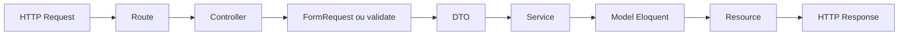
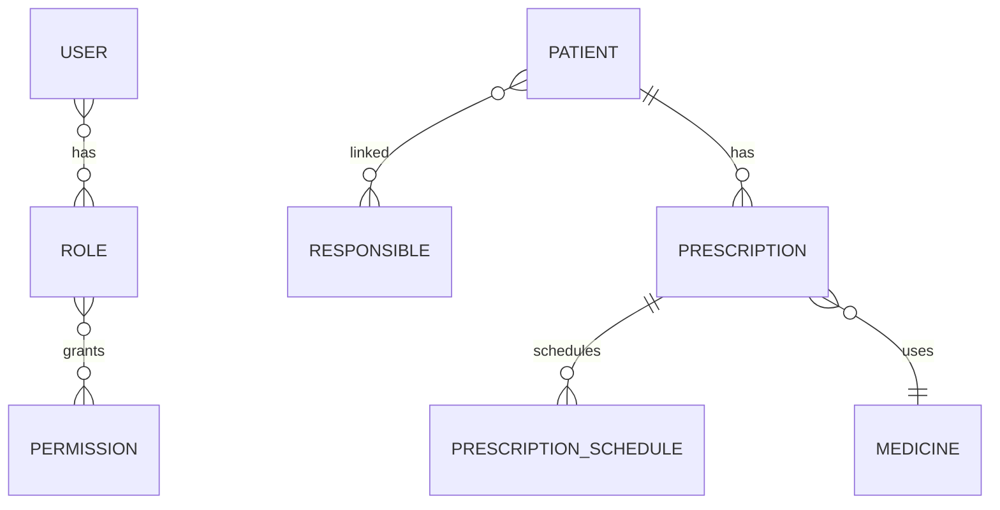

# Arquitetura

## Camadas
- Routes: define endpoints, middleware `auth:sanctum` e rotas extras de relacionamento.
- Controllers: orquestram validacao, DTO, transacao e resposta HTTP.
- FormRequests: centralizam validacoes de entrada.
- DTOs: formalizam payload entre controller e service.
- Services: encapsulam operacoes sobre modelos Eloquent.
- Models: relacionamentos, casts e regras de ciclo de vida (soft delete/restore em cascata).
- Policies: autorizacao baseada em permissao por tela.
- Resources: serializacao da resposta da API.

## Fluxo Tecnico Padrao

## Relacionamentos de Dominio (Resumo)

## Decisoes Arquiteturais Observadas
- Uso consistente de Soft Deletes para entidades de negocio.
- Regras de cascata implementadas nos modelos, nao apenas no banco.
- Autorizacao por tela/acao via combinacao Role-Permission e Policies.
- API e painel Filament convivem no mesmo projeto com tratamento de autenticacao distinto por contexto.

## Pontos de Atencao
- Nem todos os endpoints usam FormRequest (ex.: `PatientController::storePrescription`).
- Services atuais sao thin services (CRUD simples), entao regras de negocio mais complexas tendem a ficar nos controllers/model events.
