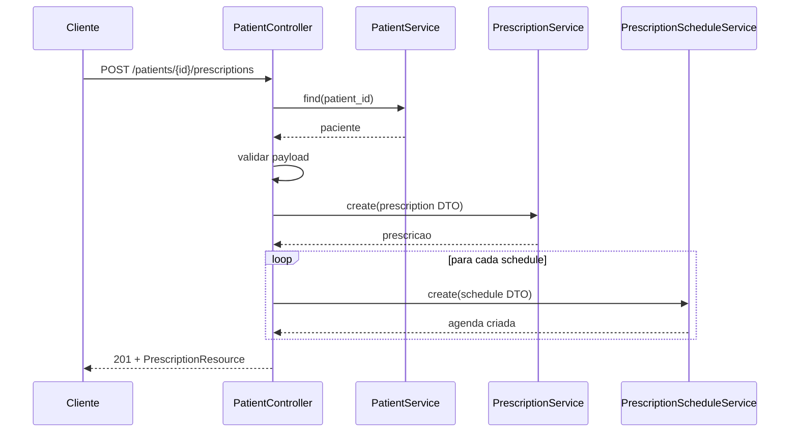

# Fluxos de Negocio

## Fluxo 1: Cadastro de Paciente
Endpoint: `POST /api/patients`

### Objetivo
Criar paciente com dados pessoais e clinicos basicos.

### Entrada
- FormRequest: `CreatePatientFormRequest`
- Campos: `name`, `document_type`, `document_number`, `admission_date`, `birthday`, `phone?`, `nursing_report?`

### Regras
- `document_type` deve ser enum valido.
- `document_number` deve ser unico por `document_type`.
- Datas devem ser validas.

### Sequencia Interna
1. Controller valida via FormRequest.
2. Monta `CreatePatientDTO` convertendo `document_type` para enum e datas para Carbon.
3. Executa `PatientService::create(...)` dentro de transacao.
4. Retorna `PatientResource` com status 201.

### Saida
- `201 Created` com payload serializado pelo resource.

### Erros Esperados
- `422` para validacao.
- `401` se sem token em rota protegida.

---

## Fluxo 2: Criar Prescricao para Paciente (com agendas)
Endpoint: `POST /api/patients/{patient}/prescriptions`

### Objetivo
Criar prescricao vinculada ao paciente e opcionalmente criar horarios de medicacao.

### Entrada
- Validacao inline no controller.
- Campos: `medicine_id`, `start_date`, `end_date`, `instructions?`, `prescription_schedules?[]`.
- Agenda: `day_of_week` (0-6), `time` (H:i), `quantity` (>= 1).

### Regras
- Paciente deve existir.
- Medicamento deve existir.
- `end_date` >= `start_date`.
- Se houver agendas, cada item deve obedecer as regras de dia/horario/quantidade.

### Sequencia Interna
1. Garante existencia do paciente via `PatientService::find(...)`.
2. Valida request.
3. Em transacao:
   - cria `CreatePrescriptionDTO` e salva via `PrescriptionService::create`.
   - itera agendas recebidas e cria cada uma via `PrescriptionScheduleService::create`.
4. Retorna `PrescriptionResource` com status 201.

### Saida
- `201 Created` com prescricao criada.

### Erros Esperados
- `404` se paciente nao existir.
- `422` para validacao.
- `401` se sem token.

### Diagrama

---

## Fluxo 3: Soft Delete e Restore em Cascata
Entidades principais: `Patient` e `Prescription`.

### Objetivo
Manter consistencia ao deletar/restaurar dados dependentes.

### Regra de Cascata
- Ao deletar paciente (soft delete), prescricoes do paciente tambem sao soft deleted.
- Ao restaurar paciente, prescricoes soft deleted sao restauradas.
- Ao force delete paciente, prescricoes (inclusive trashed) sao force deleted.
- A mesma logica se aplica de prescricao para agendas.

### Onde acontece
- `Patient::booted()`
- `Prescription::booted()`

---

## Fluxo 4: Gerir Permissoes de um Papel por Tela
Endpoints:
- `GET /api/roles/{role}/permissions?screen=...`
- `PUT /api/roles/{role}/permissions`
- `POST /api/roles/{role}/permissions/activate-all`
- `POST /api/roles/{role}/permissions/disable-all`

### Objetivo
Permitir configurar permissoes por contexto de tela sem afetar outras telas.

### Regras
- `screen` deve existir no enum `PermissionScreenEnum`.
- Sync deve preservar permissoes de outras telas.

### Sequencia Interna (sync)
1. Valida `screen` e lista `permissions` (nomes).
2. Busca IDs de permissoes selecionadas na tela alvo.
3. Busca IDs de permissoes ja vinculadas em outras telas.
4. Faz `sync` da uniao (outras telas + tela atual selecionada).

### Resultado
- Atualizacao atomica de permissoes da tela alvo, sem apagar contexto das demais telas.
