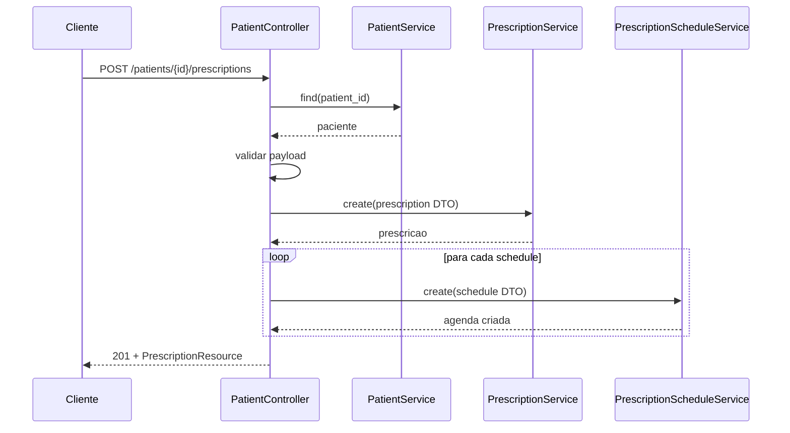

# Fluxos de Negocio

## Fluxo 1: Cadastro de Paciente
Endpoint: `POST /api/patients`

### Objetivo
Criar paciente com dados pessoais e clinicos basicos.

### Entrada
- FormRequest: `CreatePatientFormRequest`
- Campos: `name`, `document_type`, `document_number`, `admission_date`, `birthday`, `phone?`, `nursing_report?`

### Regras
- `document_type` deve ser enum valido.
- `document_number` deve ser unico por `document_type`.
- Datas devem ser validas.

### Sequencia Interna
1. Controller valida via FormRequest.
2. Monta `CreatePatientDTO` convertendo `document_type` para enum e datas para Carbon.
3. Executa `PatientService::create(...)` dentro de transacao.
4. Retorna `PatientResource` com status 201.

### Saida
- `201 Created` com payload serializado pelo resource.

### Erros Esperados
- `422` para validacao.
- `401` se sem token em rota protegida.

---

## Fluxo 2: Criar Prescricao para Paciente (com agendas)
Endpoint: `POST /api/patients/{patient}/prescriptions`

### Objetivo
Criar prescricao vinculada ao paciente e opcionalmente criar horarios de medicacao.

### Entrada
- Validacao inline no controller.
- Campos: `medicine_id`, `start_date`, `end_date`, `instructions?`, `prescription_schedules?[]`.
- Agenda: `day_of_week` (0-6), `time` (H:i), `quantity` (>= 1).

### Regras
- Paciente deve existir.
- Medicamento deve existir.
- `end_date` >= `start_date`.
- Se houver agendas, cada item deve obedecer as regras de dia/horario/quantidade.

### Sequencia Interna
1. Garante existencia do paciente via `PatientService::find(...)`.
2. Valida request.
3. Em transacao:
   - cria `CreatePrescriptionDTO` e salva via `PrescriptionService::create`.
   - itera agendas recebidas e cria cada uma via `PrescriptionScheduleService::create`.
4. Retorna `PrescriptionResource` com status 201.

### Saida
- `201 Created` com prescricao criada.

### Erros Esperados
- `404` se paciente nao existir.
- `422` para validacao.
- `401` se sem token.

### Diagrama

```mermaid
sequenceDiagram
participant C as Cliente
participant PC as PatientController
participant PS as PatientService
participant PRS as PrescriptionService
participant PSS as PrescriptionScheduleService

C->>PC: POST /patients/{id}/prescriptions
PC->>PS: find(patient_id)
PS-->>PC: paciente
PC->>PC: validar payload
PC->>PRS: create(prescription DTO)
PRS-->>PC: prescricao
loop para cada schedule
PC->>PSS: create(schedule DTO)
PSS-->>PC: agenda criada
end
PC-->>C: 201 + PrescriptionResource
```

---

## Fluxo 3: Soft Delete e Restore em Cascata
Entidades principais: `Patient` e `Prescription`.

### Objetivo
Manter consistencia ao deletar/restaurar dados dependentes.

### Regra de Cascata
- Ao deletar paciente (soft delete), prescricoes do paciente tambem sao soft deleted.
- Ao restaurar paciente, prescricoes soft deleted sao restauradas.
- Ao force delete paciente, prescricoes (inclusive trashed) sao force deleted.
- A mesma logica se aplica de prescricao para agendas.

### Onde acontece
- `Patient::booted()`
- `Prescription::booted()`

---

## Fluxo 4: Gerir Permissoes de um Papel por Tela
Endpoints:
- `GET /api/roles/{role}/permissions?screen=...`
- `PUT /api/roles/{role}/permissions`
- `POST /api/roles/{role}/permissions/activate-all`
- `POST /api/roles/{role}/permissions/disable-all`

### Objetivo
Permitir configurar permissoes por contexto de tela sem afetar outras telas.

### Regras
- `screen` deve existir no enum `PermissionScreenEnum`.
- Sync deve preservar permissoes de outras telas.

### Sequencia Interna (sync)
1. Valida `screen` e lista `permissions` (nomes).
2. Busca IDs de permissoes selecionadas na tela alvo.
3. Busca IDs de permissoes ja vinculadas em outras telas.
4. Faz `sync` da uniao (outras telas + tela atual selecionada).

### Resultado
- Atualizacao atomica de permissoes da tela alvo, sem apagar contexto das demais telas.

---

## Fluxo 5: Registrar Movimentacao de Estoque
Endpoint: `POST /api/stock-items/{stockItem}/movements`

### Objetivo
Registrar entrada, saida, ajuste de inventario ou devolucao de um item de estoque (enxoval do residente ou insumo medico), atualizando o saldo do item de forma atomica.

### Entrada
- FormRequest: `CreateStockMovementFormRequest`.
- Campos: `type` (`IN`/`OUT`/`ADJUSTMENT`/`RETURNED`), `quantity`, `patient_id?`, `batch?`, `expiry_date?`, `notes?`, `movement_date?`.
- `stock_item_id` vem da rota, `user_id` vem do usuario autenticado (nao do payload).

### Regras
- `IN`/`OUT`/`RETURNED` aplicam um delta (+/-) sobre `current_quantity`; `ADJUSTMENT` define o saldo diretamente como `quantity` (correcao de contagem fisica).
- Saldo resultante nunca pode ficar negativo (`422` em `quantity` caso contrario).
- `patient_id` obrigatorio em `OUT`/`RETURNED` quando o item e `category = RESIDENT_SUPPLY`; opcional para `MEDICAL_SUPPLY`.
- `batch`/`expiry_date` obrigatorios em `IN` quando `stock_items.requires_batch_control = true`.

### Sequencia Interna
1. Controller valida via FormRequest e monta `CreateStockMovementDTO`.
2. Em transacao: `StockMovementService::create` busca o item, valida as regras de paciente/lote, aplica o efeito do `type` sobre o saldo via `StockItemService` e cria o registro em `stock_movements`.
3. Retorna `StockMovementResource` com status 201.

### Saida
- `201 Created` com a movimentacao criada.

### Erros Esperados
- `404` se o item nao existir.
- `422` para validacao, saldo insuficiente, paciente obrigatorio ausente ou lote/validade ausentes.
- `401` se sem token.

### Fluxos relacionados
- `GET /api/patients/{patient}/stock-items` — itens de enxoval atualmente emprestados ao paciente, calculado a partir do historico de movimentacoes (`SUM(OUT) - SUM(RETURNED)`), sem tabela de atribuicao dedicada.
- `GET /api/stock-items/low-stock` — itens com `current_quantity <= minimum_quantity`.

Detalhamento completo (schema, enums, decisoes de escopo) em `docs/09-controle-de-estoque.md`.

---

## Fluxo 6: Estoque de Medicamento do Paciente

### Objetivo
Diferente do estoque de insumos/enxoval (`docs/09-controle-de-estoque.md`), a clinica **nao pode manter estoque proprio de medicamentos** por exigencia legal — quem e dono dos remedios e sempre o paciente. `PatientMedicine` guarda esse saldo real (persistido) por par (paciente, medicamento), com log de movimentacoes em `PatientMedicineMovement` (mesmos tipos `IN`/`OUT`/`ADJUSTMENT`/`RETURNED` do estoque de insumos).

### Entrada
- `POST /api/patient-medicines` — cria o saldo inicial de um medicamento para um paciente (`patient_id`, `medicine_id`, `current_quantity?`, `minimum_quantity?`).
- `POST /api/patient-medicines/{patientMedicine}/movements` — registra uma movimentacao (`type`, `quantity`, `notes?`, `movement_date?`).

### Regras
- Um saldo unico por par (`patient_id`, `medicine_id`).
- `IN`/`RETURNED` somam ao saldo; `OUT` subtrai; `ADJUSTMENT` define o saldo diretamente — mesma logica de `StockItemService`/`StockMovementService`, aplicada por `PatientMedicineService`/`PatientMedicineMovementService`.
- Saldo nunca pode ficar negativo (`422` em `quantity` caso contrario).
- `current_quantity` so muda atraves de movimentacoes, nunca via `PATCH /api/patient-medicines/{id}` (que so altera `minimum_quantity`).

### Baixa automatica na aplicacao de dose
Ao marcar uma dose como aplicada (`TodayMedicationsTable` no painel Filament), `MedicationAdministrationService::markApplied` roda em transacao:
1. Garante (cria se preciso, com saldo zerado) o `PatientMedicine` do par (paciente, medicamento) da prescricao.
2. Cria/atualiza o `MedicationAdministration` do dia.
3. Registra uma movimentacao `OUT` de `PatientMedicineMovement` com a `quantity` da `PrescriptionSchedule`, referenciando a administracao.

Se o paciente nao tiver saldo suficiente daquele medicamento, a aplicacao da dose e **bloqueada** (erro de validacao) — e preciso registrar uma entrada (`IN`) antes. Desfazer a aplicacao (`undoApplied`) estorna a quantidade com uma movimentacao `RETURNED` e remove o `MedicationAdministration`.

### Erros Esperados
- `422` para validacao, saldo insuficiente ou saldo duplicado (mesmo paciente + medicamento).
- `401` se sem token.
