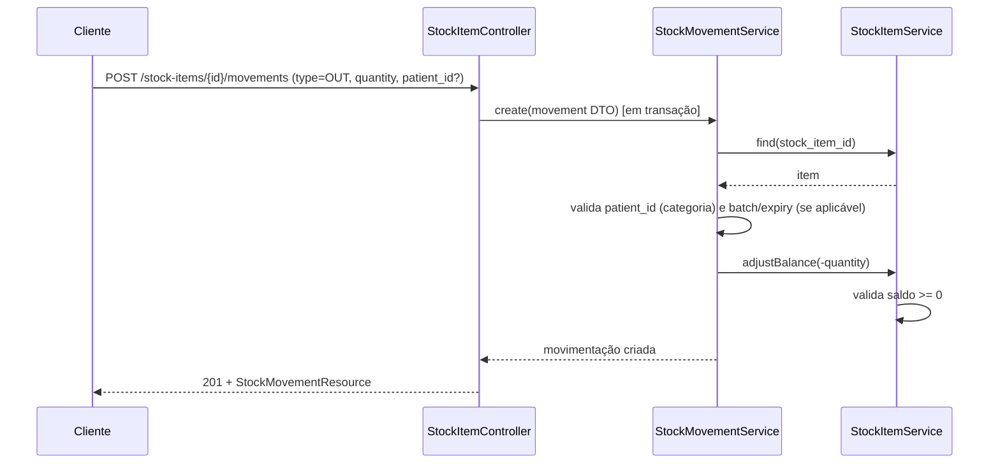

# Controle de Estoque — Especificação de Requisitos

> **Status: implementado.** As entidades, endpoints e regras abaixo já existem no código (migrations `2026_08_13_120000_create_stock_items_table` e `2026_08_13_120100_create_stock_movements_table`, models `StockItem`/`StockMovement`, `StockItemController`, `PatientController::stockItems`). A operação do dia a dia (cadastro de itens e registro de movimentações) é feita pelo **painel Filament** (`App\Filament\Resources\StockItems\StockItemResource`, grupo de navegação "Estoque"), que reaproveita os mesmos Models/Services/DTOs da API — a API HTTP também está disponível para integrações externas. As decisões que estavam em aberto na versão original deste documento foram resolvidas — ver seção 9.

## 1. Objetivo e Escopo

A clínica funciona como **casa de repouso para idosos** (entidade `Patient` no sistema atual). Além do cuidado clínico já coberto por prescrições/medicamentos, a instituição controla dois tipos de item físico:

- **Itens de enxoval/uso pessoal do residente** — ex.: travesseiro, edredom, lençol, toalha.
- **Insumos médicos/clínicos** — ex.: agulha, seringa, luvas, gaze, álcool.

### Dentro do escopo (fase 1)
- Cadastro único de itens de estoque, categorizados.
- Lançamento manual de entrada de quantidade (sem modelar fornecedor/pedido de compra).
- Saída/consumo de item, com vínculo opcional a um paciente.
- Empréstimo de item de enxoval a um paciente específico, com devolução.
- Controle de lote e validade para itens que exigem (tipicamente insumos médicos).
- Estoque mínimo com sinalização de reposição.
- Autorização por tela dedicada (`stock_screen`), seguindo o padrão já usado no projeto.

### Fora do escopo (fase 1)
- Fornecedores e pedidos de compra.
- Custo/valor financeiro dos itens.
- Reserva antecipada de itens (ex.: reservar travesseiro antes da entrada do residente).
- Relatório/exportação (CSV) e notificação ativa (e-mail/painel) de estoque baixo — hoje só via endpoint de consulta.

## 2. Perfis/Papéis Envolvidos

- **Equipe administrativa** — cadastra itens, registra entrada de enxoval, controla devoluções.
- **Equipe médica/enfermagem** — registra saída/consumo de insumos médicos, eventualmente vinculando a um paciente.
- **Administrador (`is_adm`)** — acesso total, como já ocorre nas demais telas (bypass em `CheckPermissionTrait`).

Acesso a estas ações é controlado por `Role` → `Permission` na tela `stock_screen` (ver seção 8), não por perfil fixo no código — segue o mesmo modelo já usado para as demais telas do sistema.

## 3. Entidades e Schema

Segue as convenções já estabelecidas no projeto: chave primária **ULID**, `timestamps()`, e `softDeletes()` em entidades de negócio (não em logs operacionais) — ver `ESPECIFICACOES.md` seção 3.

### `stock_items` (cadastro de itens)
| Campo | Tipo | Observações |
|---|---|---|
| id | ulid, PK | |
| name | string | |
| category | string | enum `StockItemCategoryEnum` |
| unit | string | enum `StockItemUnitEnum` |
| current_quantity | integer | saldo atual; atualizado em transação a cada movimentação (não recalculado em runtime); **não editável via `PUT`/`PATCH` do item**, só através de `stock_movements` |
| minimum_quantity | integer, nullable | usado para sinalizar estoque baixo |
| requires_batch_control | boolean | default `false`; controla se lote/validade são exigidos nas movimentações de entrada |
| additional_information | text, nullable | |
| timestamps / soft delete | | |

### `stock_movements` (log operacional de movimentações)
Sem soft delete — é log operacional, seguindo o mesmo padrão já usado em `medication_administrations` (`ESPECIFICACOES.md` seção 3).

| Campo | Tipo | Observações |
|---|---|---|
| id | ulid, PK | |
| stock_item_id | FK → stock_items, cascade on delete | |
| type | string | enum `StockMovementTypeEnum` (`IN`, `OUT`, `ADJUSTMENT`, `RETURNED`) |
| quantity | integer | sempre >= 0; o efeito no saldo depende do `type` (ver seção 5) |
| patient_id | FK → patients, nullable, null on delete | obrigatório em `OUT`/`RETURNED` quando `stock_items.category = RESIDENT_SUPPLY`; opcional nas demais combinações |
| user_id | FK → users, nullable, null on delete | quem registrou a movimentação (preenchido a partir do usuário autenticado, não vem do payload) |
| batch | string, nullable | exigido quando `stock_items.requires_batch_control = true` e `type = IN` |
| expiry_date | date, nullable | idem `batch` |
| notes | text, nullable | |
| movement_date | datetime | data/hora do evento (pode ser retroativa); default `now()` quando omitido |
| timestamps | | sem soft delete |

**Não há tabela separada de "atribuição" (ex. `stock_item_patient`).** O que um paciente tem em uso é **calculado em runtime** a partir de `SUM(OUT) - SUM(RETURNED)` para o par `(stock_item_id, patient_id)`, seguindo o mesmo princípio já aplicado em `medication_administrations` (status calculado, não persistido) — evita duplicar estado. Implementado em `PatientController::stockItems`.

## 4. Enums

| Enum | Valores | Observações |
|---|---|---|
| `StockItemCategoryEnum` | `RESIDENT_SUPPLY`, `MEDICAL_SUPPLY` | categoriza o item; usada também para decidir se `patient_id` é obrigatório em `OUT`/`RETURNED` |
| `StockItemUnitEnum` | `UNIT`, `PAIR`, `BOX`, `PACK`, `ML`, `G` | inclui unidades de medida para cobrir itens líquidos/a granel (ex. álcool) além da contagem discreta |
| `StockMovementTypeEnum` | `IN` (entrada), `OUT` (saída/consumo), `ADJUSTMENT` (ajuste de inventário), `RETURNED` (devolução de item emprestado) | `RETURN` seria palavra reservada do PHP em contexto de nome de `case`; usado `RETURNED` |

## 5. Regras de Negócio

- O efeito de cada `type` sobre `stock_items.current_quantity`:
  - `IN` → soma `quantity` ao saldo atual.
  - `OUT` → subtrai `quantity` do saldo atual.
  - `RETURNED` → soma `quantity` ao saldo atual (item emprestado que voltou).
  - `ADJUSTMENT` → **define o saldo diretamente como `quantity`** (correção de contagem física de inventário), em vez de aplicar um delta — evita ambiguidade de sinal já que `quantity` é sempre não negativo.
- Nenhuma movimentação pode deixar `current_quantity` negativo; se o resultado calculado for negativo, a API responde `422` com erro em `quantity` (`"Saldo insuficiente para esta movimentação."`).
- `current_quantity` é atualizado **na mesma transação** (`DB::transaction`) em que a movimentação é criada — segue o padrão de "Operações críticas" já descrito em `ESPECIFICACOES.md` seção 2.
- Se `stock_items.requires_batch_control = true`, uma movimentação `IN` exige `batch` e `expiry_date`; caso contrário, `422` em `batch`.
- `patient_id` é **obrigatório** em `OUT`/`RETURNED` quando `stock_items.category = RESIDENT_SUPPLY` (rastreia sempre a quem o item de enxoval foi emprestado); é **opcional** para `MEDICAL_SUPPLY` (permite tanto consumo geral quanto consumo atribuído a um paciente específico). Validado em `StockMovementService::assertPatientRequirement`.
- Um item é considerado "em estoque baixo" quando `current_quantity <= minimum_quantity` (se `minimum_quantity` estiver definido).
- Editar um `stock_item` (`PUT`/`PATCH`) nunca altera `current_quantity` — o campo não existe em `UpdateStockItemDTO`/`UpdateStockItemFormRequest`. Alterações de saldo só acontecem via `stock_movements`.
- Soft delete de `stock_items` não apaga o histórico em `stock_movements` — o log permanece por rastreabilidade, sem cascata de exclusão.

## 6. Fluxos

### 6.1 Registrar Saída de Insumo Médico (vinculada a paciente)

### 6.2 Empréstimo e Devolução de Item de Enxoval

1. `POST /stock-items/{id}/movements` com `type=OUT`, `patient_id` obrigatório (categoria `RESIDENT_SUPPLY`) — decrementa saldo, registra o residente.
2. `POST /stock-items/{id}/movements` com `type=RETURNED`, mesmo `patient_id` — incrementa saldo de volta.
3. "O que o paciente tem em uso agora" é obtido via `GET /patients/{patient}/stock-items` (calculado, não persistido — ver seção 3).

### 6.3 Alerta de Estoque Baixo

`GET /stock-items/low-stock` retorna itens onde `current_quantity <= minimum_quantity`. Sem job/cron — cálculo em runtime na consulta, mesmo espírito de `medication_administrations` (evita manter estado derivado sincronizado).

## 7. Endpoints

Seguindo o padrão `apiResource` + soft delete já usado no projeto (`ESPECIFICACOES.md` seção 5):

| Método | Rota | Descrição |
|---|---|---|
| GET/POST/PUT/DELETE | `/api/stock-items` (+`/{id}`) | CRUD padrão de itens |
| GET | `/api/stock-items/trashed` | Itens removidos (soft delete) |
| POST | `/api/stock-items/{id}/restore` | Restaura |
| DELETE | `/api/stock-items/{id}/force-delete` | Exclusão física |
| GET | `/api/stock-items/{id}/movements` | Histórico de movimentações do item |
| POST | `/api/stock-items/{id}/movements` | Registra movimentação (`IN`/`OUT`/`ADJUSTMENT`/`RETURNED`) |
| GET | `/api/stock-items/low-stock` | Itens abaixo do estoque mínimo |
| GET | `/api/patients/{patient}/stock-items` | Itens de enxoval atualmente em uso pelo paciente (calculado) |

Todas protegidas por `auth:sanctum`.

## 8. Autorização

- Novo valor em `PermissionScreenEnum`: `stock_screen`.
- Uma única tela cobre cadastro de itens **e** lançamento de movimentações — evita fragmentar em duas telas de permissão para o mesmo domínio funcional. Se no futuro a equipe médica (movimentações) e a administrativa (cadastro de item) precisarem de granularidade separada, dividir em `stock_items_screen`/`stock_movements_screen` é uma mudança de baixo risco.
- `StockItemPolicy` e `StockMovementPolicy` seguem o mesmo padrão de `PatientPolicy`/`MedicinePolicy`, usando `CheckPermissionTrait`.
- Ações avaliadas: `listar`, `exibir`, `criar`, `atualizar`, `deletar`, `restaurar`, `forçar deletar` (mesmo conjunto já usado nas demais telas).
- **Nota:** assim como nas demais Policies do projeto (`MedicinePolicy`, `PatientPolicy`, etc.), estas classes não são chamadas explicitamente pelos controllers da API (nenhum controller do projeto usa `$this->authorize()` ou middleware `can:`) — servem para autorização automática caso um recurso Filament seja criado depois. Hoje, o único controle de acesso efetivo na API é `auth:sanctum` (usuário autenticado).

## 9. Decisões (resolvidas na implementação)

- `StockItemUnitEnum` cobre unidades de medida (`ML`, `G`) além de contagem discreta.
- `patient_id` é obrigatório em `OUT`/`RETURNED` para itens `RESIDENT_SUPPLY`; opcional para `MEDICAL_SUPPLY`.
- Uma única tela de permissão (`stock_screen`) cobre itens e movimentações.
- Fornecedores/pedidos de compra ficaram fora do escopo desta fase.
- Sem relatório/exportação e sem notificação ativa de estoque baixo nesta fase — só consulta via `GET /stock-items/low-stock`.

## 10. Critérios de Aceite

- [x] Migrations de `stock_items` e `stock_movements`, com ULID, timestamps e soft delete (só em `stock_items`) conforme especificado.
- [x] Models, DTOs, Services e Resources seguindo o padrão thin-service do projeto.
- [x] `StockItemPolicy`/`StockMovementPolicy` com tela `stock_screen` em `PermissionScreenEnum`.
- [x] Endpoints da seção 7 implementados e cobertos por testes Pest (`tests/Feature/StockItemControllerTest.php`, `tests/Feature/StockMovementControllerTest.php`), incluindo caso de saldo insuficiente e item com `requires_batch_control`.
- [x] Painel Filament: `StockItemResource` (CRUD de itens, grupo "Estoque") com `StockMovementsRelationManager` (histórico e registro de movimentações na própria tela do item) e ação rápida "Registrar movimentação" na listagem — reaproveitam `StockItemService`/`StockMovementService`, mesma validação de negócio da API.
- [x] `docs/01-visao-geral.md`, `docs/03-fluxos-de-negocio.md`, `docs/05-regras-de-autorizacao.md`, `docs/06-glossario.md` e `ESPECIFICACOES.md` atualizados, conforme `docs/08-checklist-pr-documentacao.md`.

## 11. Painel Filament

- `App\Filament\Resources\StockItems\StockItemResource` — CRUD de itens (`Schemas\StockItemForm`, `Tables\StockItemsTable`), grupo de navegação "Estoque", páginas `ListStockItems`/`CreateStockItem`/`EditStockItem`.
- `Schemas\StockMovementForm` — formulário de movimentação reaproveitado em dois lugares: aba "Movimentações" do item (`RelationManagers\StockMovementsRelationManager`) e ação rápida "Registrar movimentação" direto na listagem (`StockItemsTable`).
- As duas telas chamam `StockMovementForm::create()`, que invoca `StockMovementService::create()` dentro de `DB::transaction` — mesma regra de negócio da API (saldo, paciente obrigatório para `RESIDENT_SUPPLY`, lote/validade). Erros de validação (`ValidationException`) são capturados e exibidos como `Notification` de erro, sem quebrar a tela.
- Tabela de itens: saldo em destaque (vermelho quando `current_quantity <= minimum_quantity`), filtro por categoria e filtro "Estoque baixo".
- `App\Filament\Resources\Patients\RelationManagers\StockMovementsRelationManager` — aba "Movimentações de Estoque" dentro do cadastro do paciente (`PatientResource`), usando a relação `Patient::stockMovements()`. Mostra o histórico de movimentações vinculadas àquele paciente (item, tipo, quantidade, quem registrou, data) e permite registrar uma nova diretamente por lá — nesse contexto o paciente já está fixo, então o formulário (`StockMovementForm::configureForPatient`) pede o item em vez do paciente, e restringe o tipo a `OUT`/`RETURNED` (emprestar/devolver — entrada e ajuste de inventário não fazem sentido a partir da tela de um paciente específico).
- **Fora do escopo desta rodada:** uma visão agregada "itens atualmente em uso" (saldo por item, não o histórico bruto de movimentações) direto no `PatientResource` — hoje isso só existe calculado via `GET /api/patients/{patient}/stock-items`; no painel, dá pra chegar ao mesmo resultado lendo o histórico da aba acima.

## 12. Doação de Itens (tela pública + validação pelo ADM)

Fluxo para quando um visitante/familiar quer trazer um item físico (ex.: travesseiro) para um residente específico, sem precisar de login.

### 12.1 Entidade `stock_donations`
| Campo | Tipo | Observações |
|---|---|---|
| id | ulid, PK | |
| stock_item_id | FK → stock_items, cascade on delete | |
| patient_id | FK → patients, cascade on delete | resolvido a partir do CPF informado publicamente |
| quantity | integer | |
| donor_name | string | nome de quem está trazendo |
| donor_phone | string, nullable | |
| notes | text, nullable | |
| status | string | enum `StockDonationStatusEnum` (`PENDING`, `CONFIRMED`, `CANCELLED`) |
| reviewed_by_user_id | FK → users, nullable, null on delete | admin que confirmou/cancelou |
| reviewed_at | timestamp, nullable | |
| timestamps / soft delete | | |

`stock_movements` ganhou a coluna `stock_donation_id` (FK nullable, null on delete) para rastrear quais movimentações vieram de uma doação.

### 12.2 Tela pública (sem autenticação)
- `GET /doacoes` — formulário simples (Blade + CSS inline, sem depender do build do Vite): CPF do residente, item (select vindo do catálogo `stock_items`), quantidade, nome de quem traz, telefone (opcional), observação (opcional).
- `POST /doacoes` — valida via `CreateStockDonationFormRequest` (CPF normalizado para 11 dígitos antes de validar), resolve o paciente por `document_type = CPF` + `document_number`. **Se o CPF não corresponder a nenhum paciente cadastrado, a submissão é rejeitada** com mensagem para confirmar na recepção — não cria doação "solta" sem paciente. Em caso de sucesso, cria um `StockDonation` com `status = PENDING` e redireciona com mensagem de agradecimento.
- Rotas nomeadas: `stock-donations.create` / `stock-donations.store`, registradas em `routes/web.php` (fora do grupo `auth:sanctum`).

### 12.3 Tela de validação (painel Filament, autenticado)
- `App\Filament\Resources\StockDonations\StockDonationResource` — grupo "Estoque", com badge no menu mostrando a quantidade de doações pendentes.
- Lista todas as doações (filtro de status, padrão "Pendente"), com colunas: residente, item, quantidade, quem trouxe, telefone, observações, status, data, quem conferiu.
- Ações por linha, visíveis apenas quando `status = PENDING`:
  - **Confirmar** → `StockDonationService::confirm()`: dentro de uma transação, registra uma movimentação `IN` (item chegou) seguida de uma `OUT` vinculada ao paciente (item entregue a ele) — o saldo geral do item (`current_quantity`) fica líquido inalterado, mas as duas movimentações ficam no histórico (ambas com `stock_donation_id` preenchido). Marca a doação como `CONFIRMED`.
  - **Cancelar** → `StockDonationService::cancel()`: marca como `CANCELLED`, sem nenhuma movimentação de estoque.
- Ambas as ações exigem confirmação no modal e, se a doação já tiver sido analisada (ou o item exigir lote/validade que a doação não tem como fornecer), o erro é mostrado como notificação — nada quebra silenciosamente.

### 12.4 Limitações conhecidas
- Doações de itens com `requires_batch_control = true` falham ao confirmar (a `IN` exige `batch`/`expiry_date`, que o formulário público não coleta). Nesse caso o ADM precisa registrar a entrada manualmente pela tela do item (seção 11) e só então cancelar a doação, ou tratar fora do fluxo de doação.
- Sem proteção antiabuso (captcha/rate limit) na rota pública — aceitável para uso interno/local da instituição, mas vale revisar antes de expor a URL publicamente na internet.
